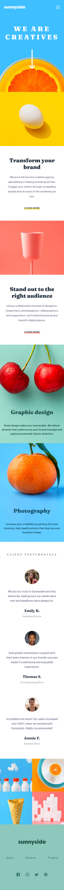

# Frontend Mentor - Sunnyside agency landing page solution

This is a solution to the [Sunnyside agency landing page challenge on Frontend Mentor](https://www.frontendmentor.io/challenges/sunnyside-agency-landing-page-7yVs3B6ef). Frontend Mentor challenges help you improve your coding skills by building realistic projects.

## Table of contents

- [Overview](#overview)
  - [The challenge](#the-challenge)
  - [Screenshot](#screenshot)
  - [Links](#links)
- [My process](#my-process)
  - [Built with](#built-with)
- [Author](#author)

## Overview

### The challenge

Users should be able to:

- View the optimal layout for the site depending on their device's screen size
- See hover states for all interactive elements on the page

### Screenshot

-Desktop Version

-Mobile Version

### Links

- Solution URL: [Repository](https://github.com/Deadflight/sunnyside-agency)
- Live Site URL: [Live site](https://deadflight.github.io/sunnyside-agency/)

## My process

### Built with

- Semantic HTML5 markup
- CSS custom properties
- Flexbox
- CSS Grid
- Mobile-first workflow
- [Sass](https://sass-lang.com/) - For styles

## Author

- Website - [Deadflight](https://deadflight.github.io/portfolio/)
- Frontend Mentor - [@Deadflight](https://www.frontendmentor.io/profile/Deadflight)
- Twitter - [@Deadfligth](https://twitter.com/Deadfligth)
- Linkedin - [@Deadfligth](https://www.linkedin.com/in/deadflight/)
- Facebook - [@Deadflight](https://www.facebook.com/Carlos-Correa-105811761669254)
- Email - correamillancarlos@gmail.com